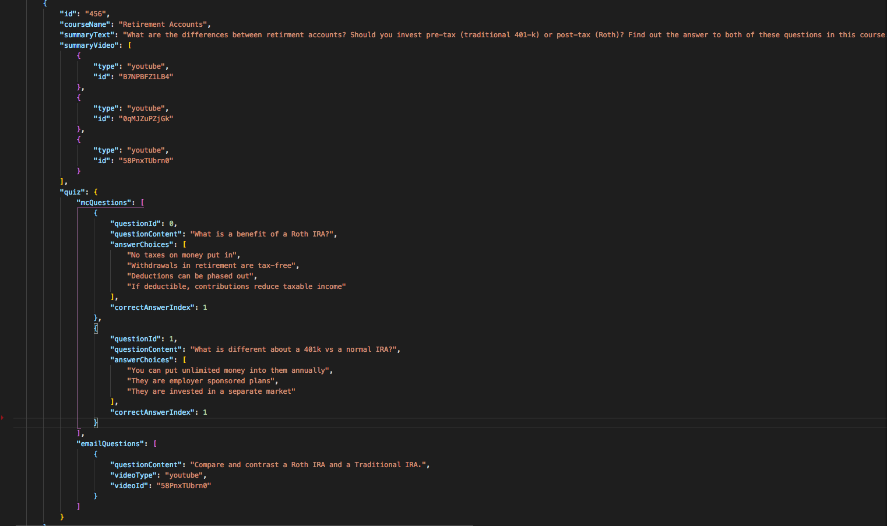

# Financial Learning Curriculum
> Release Notes
  - #### What’s New
    * This is version 1.0.0 for Georgia Tech Financial Learning Curriculum online quiz platform. The goal of this platform is to provide students with review materials for the course and closer to real-life practice experience when they encounter financial related issues. 

    - Features:
        * Kahoot code style registration codes in order to link a student with an instructor and the instructors courses. 
        * Students can:
            * View course materials
            * Take a quiz for each course, which includes:
                * A multiple choice questionnaire
                * An open ended question that is recorded and sent to professors in a daily digest
            * Provide reviews and feedback for the course after finishing a quiz
            * Review multiple choice answers and course materials on quizzes
        * Instructors can:
            * Assign courses to registration codes
            * View quiz grades and open ended responses of students enrolled in a registration code they own
            * Export grades as CSV files
            * View student reviews by course

  - #### Recent Bug Fixes
    * Clean up unnecessary fields in curriculum.json file 
    * Fixed getAllGrades api to handle multiple student grade loads
    * Check null and undefined cases for gradeByRegCodeByCourse object 
    * Limit scope for regCode query in review selection in backend
    * Show review button only after students have completed a course

  - #### Known Bugs
    * Initial login occasionally fails even with correct credentials (should only happen the first time you ever login with the introduction of the account cache)
    * The student username in grades table sometimes show blank
    * Does not work on Firefox (only works on Chrome and Safari)
    * Email feature is not guaranteed on free server (if server shuts down due to inactivity)
    * No HTTPS support

> Install Guide

- #### Prerequisites
    * To view our currently deployed application, please go to http://flp-gt.herokuapp.com/
    * To build the application from source code, you need: 
    * Node.js: https://nodejs.org/en/download/ to run the application
    * MongoDB: https://docs.mongodb.com/manual/administration/install-community/ for backend database setup
    * Git: https://git-scm.com/downloads to download and make pull requests to this repository

- #### Dependent libraries that must be installed
    * We have package.json files in our repository that has all the dependencies listed.
    * Once you have downloaded the source code repository, run `npm install` in both frontend and backend folder to install * dependencies

- #### Download instructions
    * Click on “Clone or Download” button on this page to copy git link
    * Run `git clone + link` to download this repository to your local environment

- #### Build instructions
    * No additional build needed

- #### Installation of actual application
    * After you have source code downloaded to your local environment. `cd` into both frontend folder and backend folder to run `npm install` to install all dependencies needed for the application

- #### Run instructions
    1. Open a new command line window and go to the backend folder (`cd FLP/backend`)
    2. In backend folder, start mongoDB by running `brew services start mongodb-community` if installed through Homebrew. Otherwise, start mongoDB by consulting the specific installation guide used in the "Prerequisites" step
    3. Then in the backend folder, run `npm start` to start the backend. (You should see “Listening on port 8000” on console)
    4. Open a new command line window and go to the frontend folder (`cd FLP/frontend`)
    5. In frontend folder run `npm start`
    6. Open chrome (or browser of your choice) go to “http://localhost:3000” to view application

- #### Troubleshooting
    * If there is something wrong with your database and you installed via Homebrew, Run `brew services restart mongodb-community` to restart the database before you start the backend.
    * You can install Chrome extension Redux Devtools to troubleshoot the react state.(https://chrome.google.com/webstore/detail/redux-devtools)
    * You can monitor the React DOM with the installation of Chrome React Developer Tools (https://chrome.google.com/webstore/detail/react-developer-tools/fmkadmapgofadopljbjfkapdkoienihi)
    * You can use Robo 3T or equivalent interfaces to keep track of database states for development. (https://robomongo.org) 
    * Editing the curriculum.json in the backend to have real courses, as communicated with our client
        * This JSON takes the structure of: 
    * Add student names as part of student account information
    * Integration to Canvas
    * Support instructor MP4 video uploads and LinkedIn Learning videos for courses
    * Request Gatech OIT server for official deployment
    * Migrate to HTTPS

